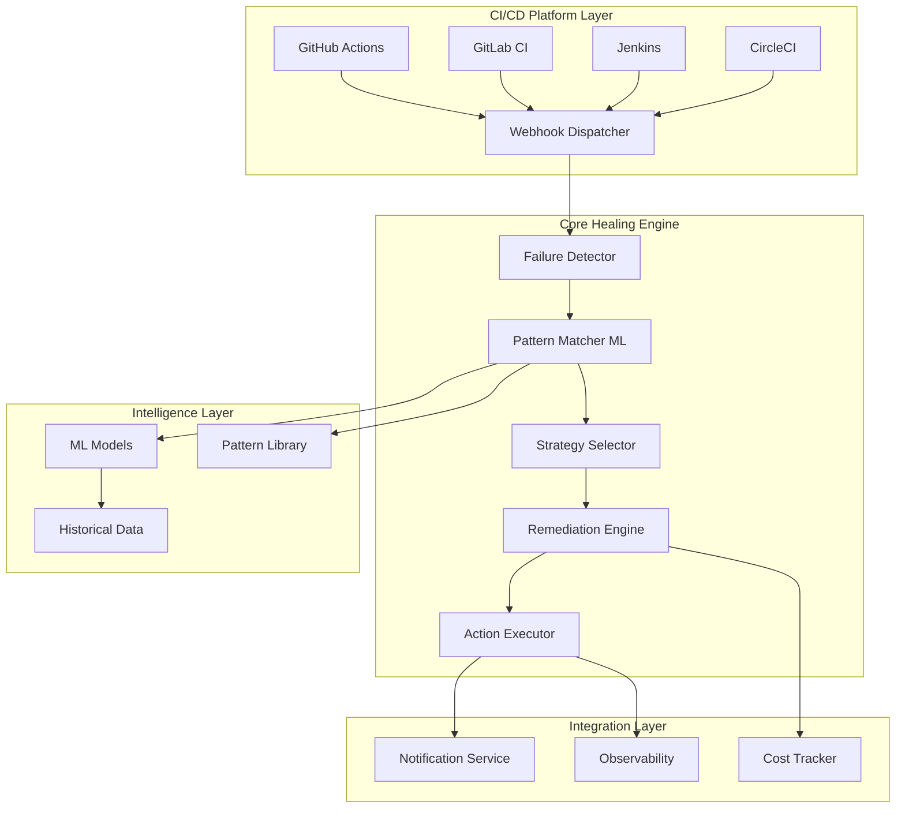

# Architecture Overview

## System Design

The Self-Healing Pipeline Guard is designed as a modular, AI-powered system that integrates with CI/CD platforms to automatically detect, diagnose, and remediate pipeline failures.

### High-Level Architecture

### Component Architecture

#### 1. Failure Detection Engine
- **Purpose**: Real-time monitoring of pipeline execution
- **Components**:
  - Webhook receivers for each CI/CD platform
  - Log parser and analyzer
  - Failure classification system
- **Technology**: Event-driven architecture with async processing

#### 2. ML Pattern Matcher
- **Purpose**: Intelligent failure pattern recognition
- **Components**:
  - Feature extraction from logs and metadata
  - Pre-trained models for common failure types
  - Continuous learning from remediation outcomes
- **Technology**: TensorFlow/PyTorch with MLOps pipeline

#### 3. Remediation Strategy Engine
- **Purpose**: Execute healing actions based on detected patterns
- **Components**:
  - Strategy registry and selector
  - Action execution framework
  - Rollback and safety mechanisms
- **Technology**: Plugin-based architecture

#### 4. Observability and Analytics
- **Purpose**: Monitor system performance and ROI metrics
- **Components**:
  - Metrics collection and aggregation
  - Cost analysis and reporting
  - Performance dashboards
- **Technology**: Prometheus, Grafana, custom analytics

### Data Flow

1. **Pipeline Failure** → Webhook notification to Guard
2. **Log Ingestion** → Parse and extract relevant features
3. **Pattern Matching** → ML models classify failure type
4. **Strategy Selection** → Choose optimal remediation approach
5. **Action Execution** → Perform healing actions
6. **Verification** → Confirm resolution or escalate
7. **Learning** → Update models with outcome data

### Security Model

- **Authentication**: OAuth 2.0/OIDC integration with CI/CD platforms
- **Authorization**: Role-based access control (RBAC)
- **Secrets Management**: Integration with platform secret stores
- **Audit Trail**: Complete logging of all healing actions
- **Data Privacy**: Configurable log sanitization

### Scalability Considerations

- **Horizontal Scaling**: Microservices architecture with container orchestration
- **Event Processing**: Message queue (Redis/RabbitMQ) for async processing
- **Model Serving**: Dedicated ML inference services
- **Caching**: Multi-layer caching for patterns and models
- **Rate Limiting**: Configurable limits to prevent resource exhaustion

### Technology Stack

#### Core Services
- **Language**: Python 3.11+ (async/await support)
- **Framework**: FastAPI for REST APIs
- **Database**: PostgreSQL for structured data, Redis for caching
- **Message Queue**: Redis Streams for event processing

#### ML/AI Components
- **ML Framework**: scikit-learn, TensorFlow, PyTorch
- **Feature Store**: Feast or custom implementation
- **Model Registry**: MLflow
- **Training Pipeline**: Kubeflow or Apache Airflow

#### Infrastructure
- **Containerization**: Docker with multi-stage builds
- **Orchestration**: Kubernetes with Helm charts
- **Service Mesh**: Istio for advanced traffic management
- **Monitoring**: Prometheus + Grafana + Jaeger

#### CI/CD Integration
- **GitHub Actions**: Native GitHub App
- **GitLab CI**: GitLab integration via webhooks
- **Jenkins**: Jenkins plugin architecture
- **Generic**: REST API for other platforms

### Deployment Models

#### SaaS (Software as a Service)
- Hosted service with multi-tenant architecture
- Platform integrations via OAuth
- Tiered pricing based on usage

#### Self-Hosted
- Docker Compose for single-node deployment
- Kubernetes for production clusters
- Helm charts for easy installation

#### Hybrid
- Core engine self-hosted
- ML models and pattern updates from cloud
- Privacy-preserving telemetry

## Integration Points

### CI/CD Platform APIs
- **GitHub Actions**: REST API and GraphQL
- **GitLab CI**: REST API and webhooks
- **Jenkins**: REST API and plugin system
- **CircleCI**: REST API v2

### External Services
- **Notification**: Slack, Microsoft Teams, Discord, Email
- **Incident Management**: Jira, ServiceNow, PagerDuty
- **Observability**: Datadog, New Relic, Splunk
- **Cost Management**: Cloud provider billing APIs

### Security Integrations
- **SAST/DAST**: Integration with security scanning tools
- **Vulnerability Management**: Snyk, WhiteSource, Dependabot
- **Compliance**: SOC 2, GDPR, HIPAA considerations

## Decision Records

### ADR-001: Event-Driven Architecture
**Status**: Accepted  
**Context**: Need to handle high volume of pipeline events from multiple platforms  
**Decision**: Use event-driven architecture with message queues  
**Consequences**: Better scalability but increased complexity

### ADR-002: Python as Primary Language
**Status**: Accepted  
**Context**: Need ML capabilities and CI/CD platform integration  
**Decision**: Use Python 3.11+ with async support  
**Consequences**: Rich ML ecosystem but potential performance limitations

### ADR-003: Kubernetes-First Deployment
**Status**: Accepted  
**Context**: Need scalable, cloud-native deployment  
**Decision**: Design for Kubernetes with Helm charts  
**Consequences**: Modern deployment model but higher operational complexity

## Future Considerations

### Roadmap Items
- Multi-cloud deployment support
- Advanced ML models with transformer architectures
- Predictive failure prevention (pre-emptive healing)
- Integration with infrastructure-as-code tools
- Support for mobile CI/CD platforms

### Technical Debt Management
- Regular dependency updates and security patches
- Model retraining pipeline automation
- Performance optimization based on telemetry data
- Legacy CI/CD platform deprecation strategy