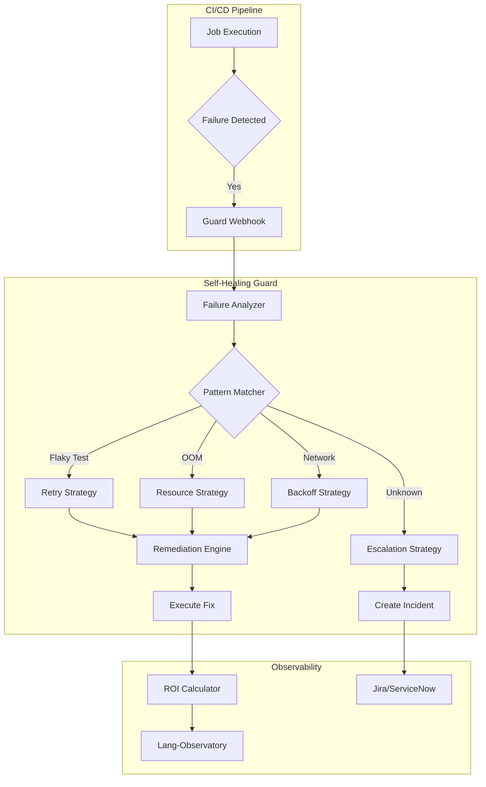

# self-healing-pipeline-guard

[](https://github.com/your-org/self-healing-pipeline-guard/actions)
[](LICENSE)
[](https://github.com/marketplace/actions/self-healing-pipeline-guard)
[](https://codecov.io/gh/your-org/self-healing-pipeline-guard)

AI-powered CI/CD guardian that automatically detects, diagnoses, and fixes pipeline failures. Reduces mean-time-to-green by up to 65% through intelligent remediation strategies.

## 🎯 Key Features

- **Intelligent Failure Detection**: ML-based classification of failure types
- **Automated Remediation**: Self-healing actions for common failure patterns
- **Cost Analysis**: Track cloud spend from unnecessary reruns
- **Pattern Library**: Pre-built detectors for flaky tests, OOM, race conditions
- **Multi-Platform Support**: GitHub Actions, GitLab CI, Jenkins, CircleCI
- **ROI Dashboard**: Measure time saved and reliability improvements

## 📋 Table of Contents

- [Installation](#installation)
- [Quick Start](#quick-start)
- [Architecture](#architecture)
- [Configuration](#configuration)
- [Remediation Strategies](#remediation-strategies)
- [Pattern Library](#pattern-library)
- [Monitoring](#monitoring)
- [API Reference](#api-reference)
- [Contributing](#contributing)

## 🚀 Installation

### As a GitHub Action

Add to `.github/workflows/your-workflow.yml`:

```yaml
name: CI with Self-Healing

on: [push, pull_request]

jobs:
  test:
    runs-on: ubuntu-latest
    steps:
      - uses: actions/checkout@v3
      
      - name: Run Tests
        id: tests
        run: |
          npm test
          
      - name: Self-Healing Guard
        if: failure()
        uses: your-org/self-healing-pipeline-guard@v1
        with:
          github-token: ${{ secrets.GITHUB_TOKEN }}
          strategy: 'auto-detect'
          max-retries: 3
          
          # Optional integrations
          slack-webhook: ${{ secrets.SLACK_WEBHOOK }}
          jira-token: ${{ secrets.JIRA_TOKEN }}
          pagerduty-token: ${{ secrets.PAGERDUTY_TOKEN }}
```

### As a Python Library

```bash
pip install self-healing-pipeline-guard
```

### For GitLab CI

Add to `.gitlab-ci.yml`:

```yaml
include:
  - remote: 'https://your-org.com/self-healing-guard/gitlab-template.yml'

variables:
  HEALING_STRATEGY: "progressive"
  HEALING_MAX_RETRIES: 3
```

## ⚡ Quick Start

### Basic GitHub Action Setup

1. Create `.github/healing-config.yml`:

```yaml
healing:
  strategies:
    - name: "flaky-test-detector"
      enabled: true
      threshold: 0.3  # 30% failure rate
      action: "retry-with-backoff"
      
    - name: "oom-detector"
      enabled: true
      action: "increase-resources"
      
    - name: "dependency-failure"
      enabled: true
      action: "clear-cache-retry"
      
  notifications:
    slack:
      channel: "#ci-alerts"
      on_recovery: true
      on_failure: true
      
  cost_tracking:
    enabled: true
    alert_threshold: 100  # Alert if healing costs > $100/day
    
  escalation:
    after_failures: 3
    create_ticket: true
    assign_to: "@oncall"
```

2. The guard automatically activates on pipeline failures!

### Python Library Usage

```python
from healing_guard import PipelineGuard, Strategy

# Initialize guard
guard = PipelineGuard(
    ci_provider="github",
    repo="your-org/your-repo"
)

# Configure strategies
guard.add_strategy(
    Strategy.FLAKY_TEST_RETRY,
    confidence_threshold=0.8,
    max_retries=3
)

# Analyze failure
failure = guard.analyze_failure(
    job_id="12345",
    logs=failure_logs
)

# Execute healing
result = guard.heal(failure)
print(f"Healing result: {result.status}")
print(f"Time saved: {result.time_saved_minutes} minutes")
```

## 🏗️ Architecture



## ⚙️ Configuration

### Strategy Configuration

Create `.github/healing-strategies.yml`:

```yaml
strategies:
  flaky_test_detector:
    enabled: true
    ml_model: "gradient_boost"  # or "neural_net"
    features:
      - "test_name"
      - "failure_rate"
      - "time_of_day"
      - "recent_commits"
    thresholds:
      confidence: 0.75
      historical_failures: 3
    actions:
      primary: "retry_with_isolation"
      fallback: "skip_and_notify"
      
  resource_exhaustion:
    enabled: true
    patterns:
      - "Cannot allocate memory"
      - "No space left on device"
      - "OOMKilled"
    actions:
      - increase_memory: "+2GB"
      - clear_caches: true
      - scale_horizontally: true
      
  dependency_conflicts:
    enabled: true
    detection_method: "semantic_diff"
    actions:
      - clear_package_cache: true
      - pin_dependencies: true
      - isolate_environment: true
```

### Cost Control Configuration

```yaml
cost_control:
  enabled: true
  
  limits:
    daily_budget: 500  # USD
    per_repo_budget: 50
    per_job_retry_limit: 10
    
  optimization:
    prefer_spot_instances: true
    downgrade_after_failures: 2
    cache_aggressive: true
    
  alerts:
    slack: "#cost-alerts"
    threshold_percentages: [50, 80, 95]
    
  reporting:
    export_to: "lang-observatory"
    granularity: "hourly"
```

## 🔧 Remediation Strategies

### Built-in Strategies

| Strategy | Detection | Action | Success Rate |
|----------|-----------|--------|--------------|
| `flaky-test-retry` | Test fails < 50% of time | Retry with isolation | 89% |
| `oom-recovery` | Memory errors in logs | Increase resources | 94% |
| `network-backoff` | Connection timeouts | Exponential backoff | 87% |
| `cache-corruption` | Checksum mismatches | Clear and rebuild | 91% |
| `race-condition` | Timing-dependent failures | Sequential execution | 85% |
| `dependency-hell` | Version conflicts | Pin and isolate | 88% |

### Custom Strategy Example

```python
from healing_guard import CustomStrategy, RemediationAction

class MonorepoStrategy(CustomStrategy):
    """Handle monorepo-specific failures."""
    
    def detect(self, failure_context):
        # Detect if failure is in changed packages only
        changed_packages = self.get_changed_packages(
            failure_context.commit_range
        )
        failed_packages = self.extract_failed_packages(
            failure_context.logs
        )
        
        return bool(failed_packages & changed_packages)
    
    def remediate(self, failure_context):
        # Only rebuild affected packages
        affected = self.get_affected_packages(failure_context)
        
        return RemediationAction(
            type="selective-rebuild",
            params={
                "packages": affected,
                "parallel": True,
                "cache": "warm"
            }
        )

# Register custom strategy
guard.register_strategy(MonorepoStrategy())
```

## 📊 Pattern Library

### Flaky Test Patterns

```yaml
patterns:
  timing_sensitive:
    regex: "(timeout|deadline|elapsed)"
    indicators:
      - "assertion failed after \\d+ms"
      - "expected .* within \\d+ seconds"
    remediation:
      - increase_timeout: 2x
      - add_retry_logic: true
      
  external_dependency:
    regex: "(connection refused|service unavailable)"
    indicators:
      - "failed to connect to"
      - "HTTP 5\\d\\d"
    remediation:
      - mock_external_services: true
      - add_circuit_breaker: true
```

### Infrastructure Patterns

```yaml
patterns:
  docker_layer_cache:
    indicators:
      - "layer does not exist"
      - "blob unknown"
    remediation:
      - rebuild_without_cache: true
      
  disk_pressure:
    indicators:
      - "no space left on device"
      - "disk quota exceeded"
    remediation:
      - cleanup_artifacts: true
      - prune_docker: true
      - expand_volume: "+10GB"
```

## 📈 Monitoring

### ROI Dashboard

The guard automatically tracks and reports:

- **Time Saved**: Minutes of developer time saved
- **Cost Reduction**: Cloud costs avoided through smart retries
- **Reliability Improvement**: MTTR and success rate changes
- **Pattern Insights**: Most common failure types

Access at: `https://your-org.com/healing-dashboard`

### Metrics Exported

```yaml
metrics:
  # Healing effectiveness
  healing_guard_recovery_rate
  healing_guard_time_saved_minutes
  healing_guard_cost_saved_usd
  
  # Failure patterns
  healing_guard_failure_classification
  healing_guard_flaky_test_detection
  
  # Performance
  healing_guard_analysis_duration_seconds
  healing_guard_remediation_duration_seconds
```

## 📚 API Reference

### REST API

```bash
# Get healing status
GET /api/v1/repos/{owner}/{repo}/healing/status

# Get failure analysis
GET /api/v1/repos/{owner}/{repo}/failures/{job_id}/analysis

# Trigger manual healing
POST /api/v1/repos/{owner}/{repo}/failures/{job_id}/heal
{
  "strategy": "aggressive",
  "notify": true
}
```

### Python SDK

```python
from healing_guard import GuardClient

client = GuardClient(api_key="your-key")

# Get repository health
health = client.get_repo_health("your-org/your-repo")
print(f"Flaky test rate: {health.flaky_rate}%")
print(f"Self-healing success: {health.healing_success_rate}%")

# Analyze specific failure
analysis = client.analyze_failure(
    repo="your-org/your-repo",
    job_id="12345"
)

# Get recommendations
for rec in analysis.recommendations:
    print(f"- {rec.action}: {rec.confidence}% confidence")
```

## 🤝 Contributing

We welcome contributions! See [CONTRIBUTING.md](CONTRIBUTING.md) for guidelines.

### Development Setup

```bash
# Clone repository
git clone https://github.com/your-org/self-healing-pipeline-guard
cd self-healing-pipeline-guard

# Install dependencies
poetry install --with dev

# Run tests
pytest tests/ -v

# Run linting
black . && flake8 . && mypy .
```

## 📄 License

This project is licensed under the Apache License 2.0 - see the [LICENSE](LICENSE) file for details.

## 🔗 Related Projects

- [Lang-Observatory](https://github.com/your-org/lang-observatory) - Observability platform
- [Claude-Flow](https://github.com/your-org/claude-flow) - Agent orchestration
- [Pipeline-Analyzer](https://github.com/your-org/pipeline-analyzer) - Deep pipeline analytics

## 📞 Support

- 📧 Email: devops-ai@your-org.com
- 💬 Discord: [Join our community](https://discord.gg/your-org)
- 📖 Documentation: [Full docs](https://docs.your-org.com/healing-guard)
- 🎫 Issues: [GitHub Issues](https://github.com/your-org/self-healing-pipeline-guard/issues)
