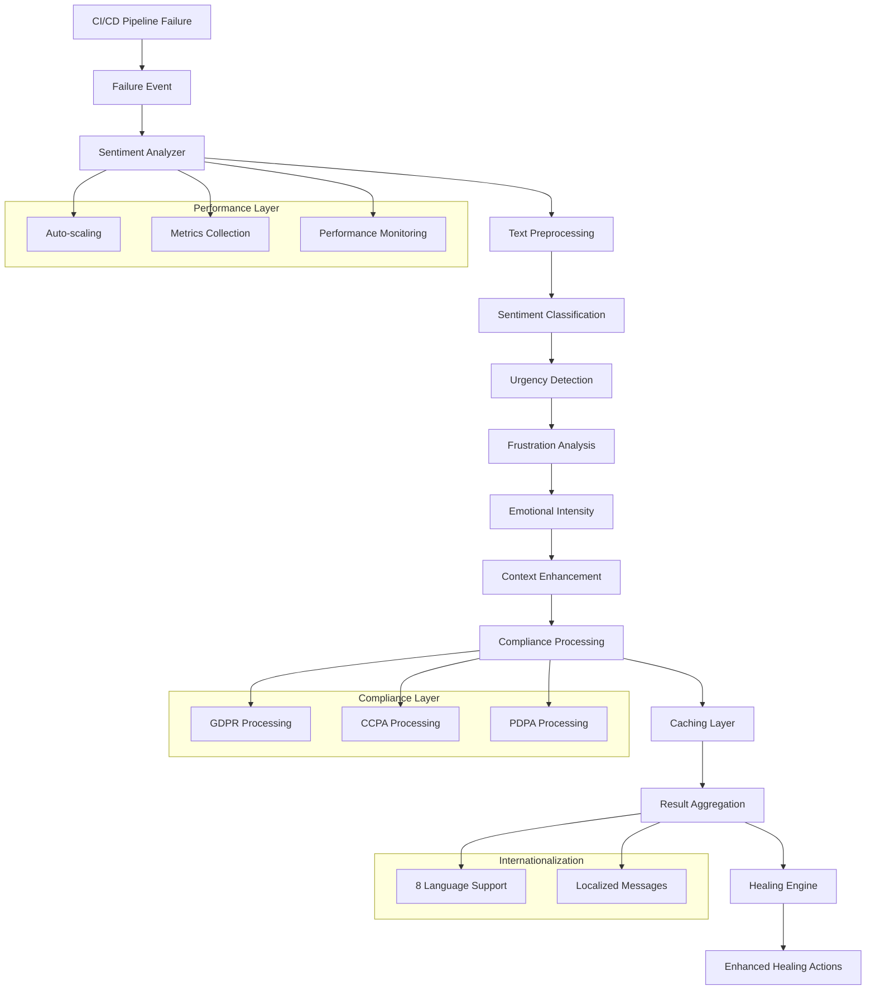
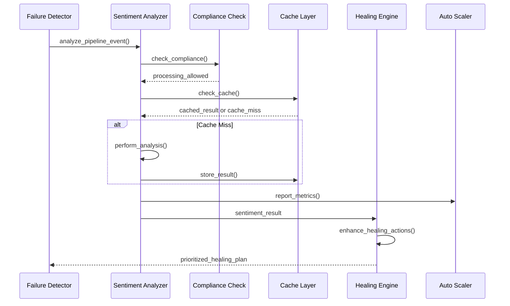

# Sentiment Analysis System Documentation

## Overview

The Self-Healing Pipeline Guard's sentiment analysis system adds intelligent emotional context analysis to CI/CD pipeline failures, enabling more nuanced and developer-centric healing strategies. This system analyzes failure logs, commit messages, and contextual information to determine urgency, frustration levels, and emotional intensity, which directly influences healing prioritization and action selection.

## Table of Contents

1. [Architecture](#architecture)
2. [Core Components](#core-components)
3. [Sentiment Classification](#sentiment-classification)
4. [Integration Points](#integration-points)
5. [Performance Features](#performance-features)
6. [Compliance Features](#compliance-features)
7. [API Reference](#api-reference)
8. [Configuration](#configuration)
9. [Best Practices](#best-practices)
10. [Troubleshooting](#troubleshooting)

## Architecture

### High-Level Architecture



### Component Interaction Flow



## Core Components

### 1. Pipeline Sentiment Analyzer

The main component responsible for sentiment analysis of pipeline events.

**File**: `healing_guard/core/sentiment_analyzer.py`

#### Key Features

- **Multi-modal Analysis**: Processes text, context, and metadata
- **Real-time Processing**: Sub-second analysis for urgent failures
- **Context-aware**: Considers repository, environment, and failure history
- **Compliance-integrated**: Automatic privacy protection

#### Core Methods

```python
class PipelineSentimentAnalyzer:
    async def analyze_text(self, text: str, context: Optional[Dict[str, Any]] = None) -> SentimentResult
    async def analyze_pipeline_event(self, event_type: str, message: str, metadata: Dict[str, Any]) -> SentimentResult
    async def analyze_batch(self, texts: List[str]) -> List[SentimentResult]
    def get_performance_stats(self) -> Dict[str, Any]
```

### 2. Sentiment Classification System

#### Sentiment Labels

The system classifies sentiment into six primary categories:

```python
class SentimentLabel(Enum):
    POSITIVE = "positive"      # Success, satisfaction
    NEGATIVE = "negative"      # Disappointment, concern
    NEUTRAL = "neutral"        # Factual, informational
    FRUSTRATED = "frustrated"  # Repeated failures, blocked progress
    URGENT = "urgent"         # Time-sensitive, production issues
    CONFUSED = "confused"     # Unclear errors, need guidance
```

#### Sentiment Metrics

Each analysis produces comprehensive metrics:

```python
@dataclass
class SentimentResult:
    label: SentimentLabel
    confidence: float                    # 0.0 to 1.0
    urgency_score: float                # 0.0 to 1.0
    emotional_intensity: float          # 0.0 to 1.0
    context_factors: Dict[str, Any]     # Environmental factors
    is_urgent: bool                     # Computed urgency flag
    is_frustrated: bool                 # Computed frustration flag
    is_negative: bool                   # Computed negativity flag
    processing_time_ms: float           # Performance metric
    cached: bool                        # Cache hit indicator
    compliance_processed: bool          # Privacy processing flag
```

### 3. Context Analysis Engine

#### Environmental Context Factors

The system considers multiple context factors:

```python
CONTEXT_FACTORS = {
    "is_production": 1.5,          # Production environment multiplier
    "is_main_branch": 1.3,         # Main/master branch importance
    "consecutive_failures": 1.2,    # Repeated failure impact
    "weekend_or_holiday": 1.1,     # Off-hours timing
    "team_size": 0.1,              # Larger teams, shared impact
    "project_criticality": 1.4,    # Business-critical projects
    "external_dependencies": 1.2,  # Third-party service issues
    "deployment_window": 1.3       # During deployment periods
}
```

#### Failure Pattern Recognition

```python
FAILURE_PATTERNS = {
    "flaky_test": {
        "keywords": ["intermittent", "flaky", "sometimes"],
        "urgency_modifier": 0.8,
        "frustration_modifier": 1.4
    },
    "infrastructure": {
        "keywords": ["timeout", "connection", "network"],
        "urgency_modifier": 1.3,
        "frustration_modifier": 1.1
    },
    "dependency": {
        "keywords": ["dependency", "package", "version"],
        "urgency_modifier": 1.1,
        "frustration_modifier": 1.2
    }
}
```

## Sentiment Classification

### 1. Text Preprocessing

Before analysis, text undergoes comprehensive preprocessing:

```python
def preprocess_text(self, text: str) -> str:
    # Remove sensitive information (emails, IPs, tokens)
    text = self.sanitize_sensitive_data(text)
    
    # Normalize whitespace and encoding
    text = self.normalize_text(text)
    
    # Extract technical terms and preserve context
    text = self.preserve_technical_context(text)
    
    # Apply language detection and normalization
    text = self.normalize_language(text)
    
    return text
```

### 2. Sentiment Detection Algorithms

#### Keyword-Based Classification

```python
SENTIMENT_KEYWORDS = {
    SentimentLabel.FRUSTRATED: {
        "primary": ["frustrated", "annoyed", "blocked", "stuck", "again", "still"],
        "secondary": ["why", "broken", "failing", "keeps", "always"],
        "weight": 1.2
    },
    SentimentLabel.URGENT: {
        "primary": ["urgent", "critical", "production", "down", "broken"],
        "secondary": ["asap", "immediately", "now", "emergency"],
        "weight": 1.5
    },
    SentimentLabel.CONFUSED: {
        "primary": ["confused", "unclear", "what", "how", "why"],
        "secondary": ["strange", "weird", "unexpected", "???"],
        "weight": 1.0
    }
}
```

#### Pattern-Based Analysis

```python
SENTIMENT_PATTERNS = {
    "repeated_failure": {
        "pattern": r"(fail|error|broken).*again|still.*fail",
        "sentiment": SentimentLabel.FRUSTRATED,
        "confidence_boost": 0.2
    },
    "production_issue": {
        "pattern": r"prod(uction)?.*down|live.*fail",
        "sentiment": SentimentLabel.URGENT,
        "confidence_boost": 0.3
    },
    "time_pressure": {
        "pattern": r"need.*asap|urgent.*fix|deadline",
        "sentiment": SentimentLabel.URGENT,
        "confidence_boost": 0.25
    }
}
```

### 3. Context-Enhanced Classification

The system enhances basic sentiment with contextual information:

```python
def enhance_with_context(
    self, 
    base_sentiment: SentimentLabel, 
    base_confidence: float,
    context: Dict[str, Any]
) -> Tuple[SentimentLabel, float]:
    
    enhanced_confidence = base_confidence
    enhanced_sentiment = base_sentiment
    
    # Production environment increases urgency
    if context.get("is_production", False):
        if base_sentiment in [SentimentLabel.NEGATIVE, SentimentLabel.FRUSTRATED]:
            enhanced_sentiment = SentimentLabel.URGENT
            enhanced_confidence *= 1.3
    
    # Consecutive failures increase frustration
    consecutive_failures = context.get("consecutive_failures", 0)
    if consecutive_failures > 2:
        if base_sentiment == SentimentLabel.NEGATIVE:
            enhanced_sentiment = SentimentLabel.FRUSTRATED
            enhanced_confidence *= 1.2
    
    # Weekend/holiday deployments increase stress
    if context.get("weekend_or_holiday", False):
        enhanced_confidence *= 1.1
    
    return enhanced_sentiment, min(1.0, enhanced_confidence)
```

## Integration Points

### 1. Healing Engine Integration

The sentiment analysis directly influences healing strategy selection:

```python
def _enhance_actions_with_sentiment(
    self, 
    actions: List[HealingAction], 
    sentiment_result: SentimentResult, 
    failure_event: FailureEvent
) -> List[HealingAction]:
    
    enhanced_actions = []
    
    for action in actions:
        enhanced_action = action
        
        # Urgent sentiment: faster actions, reduced timeouts
        if sentiment_result.is_urgent:
            enhanced_action.estimated_duration *= 0.5
            enhanced_action.parameters["timeout_reduction"] = True
            
        # Frustrated sentiment: detailed logging, progress updates
        elif sentiment_result.is_frustrated:
            enhanced_action.parameters["detailed_logging"] = True
            enhanced_action.parameters["progress_notifications"] = True
            
        # High emotional intensity: increase resource allocation
        if sentiment_result.emotional_intensity > 0.6:
            if action.strategy == HealingStrategy.INCREASE_RESOURCES:
                cpu_increase = action.parameters.get("cpu_increase", 2.0)
                enhanced_action.parameters["cpu_increase"] = cpu_increase * 1.5
        
        enhanced_actions.append(enhanced_action)
    
    return enhanced_actions
```

### 2. Priority Calculation Enhancement

```python
def _calculate_healing_priority(
    self,
    failure_event: FailureEvent,
    total_cost: float,
    success_probability: float,
    sentiment_result: Optional[SentimentResult] = None
) -> int:
    
    base_priority = failure_event.severity.value * 10
    
    # Sentiment-based adjustments (lower = higher priority)
    sentiment_factor = 0
    if sentiment_result:
        if sentiment_result.is_urgent:
            sentiment_factor = -15  # Highest priority boost
        elif sentiment_result.is_frustrated:
            sentiment_factor = -8   # High priority boost
        elif sentiment_result.urgency_score > 0.7:
            sentiment_factor = -12
        elif sentiment_result.emotional_intensity > 0.6:
            sentiment_factor = -3   # Moderate priority boost
    
    return max(1, base_priority + sentiment_factor)
```

### 3. API Integration

#### FastAPI Route Integration

```python
@router.post("/analyze", response_model=SentimentResponse)
async def analyze_sentiment(
    request: SentimentAnalysisRequest,
    current_user: User = Depends(get_current_user)
) -> SentimentResponse:
    
    try:
        # Perform sentiment analysis
        result = await sentiment_analyzer.analyze_text(
            text=request.text,
            context=request.context
        )
        
        # Convert to response format
        return SentimentResponse(
            sentiment=result.label.value,
            confidence=result.confidence,
            urgency_score=result.urgency_score,
            emotional_intensity=result.emotional_intensity,
            processing_time_ms=result.processing_time_ms,
            cached=result.cached,
            context_factors=result.context_factors
        )
        
    except Exception as e:
        logger.error(f"Sentiment analysis failed: {e}")
        raise HTTPException(status_code=500, detail="Analysis failed")
```

## Performance Features

### 1. Multi-Level Caching

#### LRU Cache Implementation

```python
class SentimentCache:
    def __init__(self, max_size: int = 10000, ttl_seconds: int = 1800):
        self.lru_cache = LRUCache(max_size)
        self.lfu_cache = LFUCache(max_size // 2)
        self.adaptive_cache = AdaptiveCache(max_size // 4)
        self.ttl_seconds = ttl_seconds
    
    async def get_cached_result(self, cache_key: str) -> Optional[SentimentResult]:
        # Try LRU first (most recent)
        if result := await self.lru_cache.get(cache_key):
            if not self._is_expired(result):
                return result
        
        # Try LFU for popular items
        if result := await self.lfu_cache.get(cache_key):
            if not self._is_expired(result):
                await self.lru_cache.set(cache_key, result)  # Promote to LRU
                return result
        
        # Try adaptive cache for pattern-based hits
        return await self.adaptive_cache.get(cache_key)
```

#### Cache Performance Monitoring

```python
@collect_sentiment_metrics("cache_performance")
async def get_cache_statistics(self) -> Dict[str, Any]:
    return {
        "lru_stats": {
            "size": len(self.lru_cache),
            "hit_rate": self.lru_cache.get_hit_rate(),
            "memory_usage_mb": self.lru_cache.get_memory_usage()
        },
        "lfu_stats": {
            "size": len(self.lfu_cache),
            "hit_rate": self.lfu_cache.get_hit_rate(),
            "popular_patterns": self.lfu_cache.get_top_keys(10)
        },
        "adaptive_stats": {
            "learning_effectiveness": self.adaptive_cache.get_learning_score(),
            "prediction_accuracy": self.adaptive_cache.get_prediction_accuracy()
        }
    }
```

### 2. Auto-Scaling System

#### Intelligent Worker Pool Management

```python
class SentimentAutoScaler:
    def __init__(self):
        self.min_workers = 2
        self.max_workers = 20
        self.current_workers = 4
        self.metrics_history = deque(maxlen=100)
        self.load_predictor = LoadPredictor()
    
    async def scale_workers(self) -> Dict[str, Any]:
        current_metrics = await self.collect_current_metrics()
        predicted_load = await self.load_predictor.predict_load(
            current_metrics, 
            time_horizon_minutes=10
        )
        
        target_workers = self.calculate_target_workers(predicted_load)
        
        if target_workers > self.current_workers:
            await self.scale_up(target_workers - self.current_workers)
        elif target_workers < self.current_workers:
            await self.scale_down(self.current_workers - target_workers)
        
        return {
            "action": "scaled" if target_workers != self.current_workers else "no_change",
            "previous_workers": self.current_workers,
            "new_workers": target_workers,
            "predicted_load": predicted_load,
            "scaling_reason": self.get_scaling_reason(current_metrics)
        }
```

### 3. Performance Monitoring

#### Real-time Metrics Collection

```python
class SentimentMetricsCollector:
    def __init__(self):
        self.request_counter = Counter()
        self.response_time_histogram = Histogram(
            "sentiment_analysis_duration_seconds",
            "Time spent on sentiment analysis",
            buckets=[0.1, 0.25, 0.5, 1.0, 2.5, 5.0, 10.0]
        )
        self.cache_hit_counter = Counter()
        self.error_counter = Counter()
    
    @contextmanager
    def time_operation(self, operation_name: str):
        start_time = time.perf_counter()
        try:
            yield
        finally:
            duration = time.perf_counter() - start_time
            self.response_time_histogram.labels(operation=operation_name).observe(duration)
    
    def record_cache_event(self, event_type: str, cache_type: str):
        self.cache_hit_counter.labels(
            event_type=event_type, 
            cache_type=cache_type
        ).inc()
    
    def get_performance_summary(self) -> Dict[str, Any]:
        return {
            "total_requests": self.request_counter._value.sum(),
            "average_response_time": self.response_time_histogram._sum.sum() / max(1, self.request_counter._value.sum()),
            "cache_hit_rate": self.calculate_cache_hit_rate(),
            "error_rate": self.calculate_error_rate(),
            "current_throughput": self.calculate_current_throughput()
        }
```

## Compliance Features

### 1. GDPR Compliance

#### Automated Data Processing Records

```python
class GDPRSentimentProcessor:
    async def process_with_gdpr_compliance(
        self,
        text: str,
        data_subject_id: Optional[str] = None,
        legal_basis: LegalBasis = LegalBasis.LEGITIMATE_INTEREST
    ) -> Dict[str, Any]:
        
        # Check processing legality
        if not self.can_process_data(data_subject_id, legal_basis):
            return {"error": "GDPR_PROCESSING_NOT_ALLOWED"}
        
        # Record processing activity
        processing_id = self.record_processing_activity(
            data_subject_id=data_subject_id,
            data_type="sentiment_analysis_request",
            processing_purpose=DataProcessingPurpose.SENTIMENT_ANALYSIS,
            legal_basis=legal_basis
        )
        
        # Perform analysis with privacy protection
        result = await self.analyze_with_privacy_protection(text)
        
        return {
            "sentiment_result": result,
            "gdpr_compliance": {
                "processing_id": processing_id,
                "legal_basis": legal_basis.value,
                "retention_period_days": 90,
                "data_subject_rights": self.get_data_subject_rights_info()
            }
        }
```

### 2. CCPA Compliance

#### Consumer Rights Management

```python
class CCPASentimentProcessor:
    def handle_consumer_opt_out(self, consumer_id: str) -> str:
        # Record opt-out preference
        opt_out_id = self.record_opt_out(consumer_id)
        
        # Update processing restrictions
        self.processing_restrictions[consumer_id] = {
            "data_sale_prohibited": True,
            "processing_limited": True,
            "third_party_sharing": False
        }
        
        return opt_out_id
    
    async def process_with_ccpa_compliance(
        self,
        text: str,
        consumer_id: Optional[str] = None
    ) -> Dict[str, Any]:
        
        # Check opt-out status
        if consumer_id and self.consumer_opted_out(consumer_id):
            processing_limitations = self.get_processing_limitations(consumer_id)
        else:
            processing_limitations = None
        
        # Process with appropriate restrictions
        result = await self.analyze_with_restrictions(text, processing_limitations)
        
        return {
            "sentiment_result": result,
            "ccpa_compliance": {
                "consumer_opted_out": processing_limitations is not None,
                "data_sale_prohibited": True,  # We don't sell sentiment data
                "consumer_rights": self.get_consumer_rights_info()
            }
        }
```

### 3. PDPA Compliance

#### Multi-Jurisdiction Support

```python
class PDPASentimentProcessor:
    def __init__(self, jurisdiction: PDPAJurisdiction):
        self.jurisdiction = jurisdiction
        self.consent_requirements = self.get_jurisdiction_requirements(jurisdiction)
        self.retention_periods = self.get_retention_periods(jurisdiction)
    
    async def process_with_pdpa_compliance(
        self,
        text: str,
        individual_id: Optional[str] = None
    ) -> Dict[str, Any]:
        
        # Verify consent for processing
        if individual_id:
            consent_valid = self.verify_consent(
                individual_id,
                PDPAPurpose.SERVICE_PROVISION,
                PDPADataType.PERSONAL_DATA
            )
            
            if not consent_valid:
                return {"error": "PDPA_CONSENT_REQUIRED"}
        
        # Process with jurisdiction-specific rules
        result = await self.analyze_with_jurisdiction_rules(text, self.jurisdiction)
        
        return {
            "sentiment_result": result,
            "pdpa_compliance": {
                "jurisdiction": self.jurisdiction.value,
                "consent_valid": consent_valid if individual_id else None,
                "retention_period_days": self.retention_periods[PDPADataType.PERSONAL_DATA],
                "individual_rights": self.get_individual_rights_info()
            }
        }
```

### 4. Unified Compliance Management

```python
class UnifiedComplianceSentimentAnalyzer:
    async def analyze_with_unified_compliance(
        self,
        text: str,
        user_id: Optional[str] = None,
        compliance_context: Optional[ComplianceContext] = None
    ) -> UnifiedComplianceResult:
        
        # Determine applicable frameworks
        frameworks = compliance_context.get_applicable_frameworks()
        
        result = UnifiedComplianceResult(
            processing_allowed=True,
            applicable_frameworks=frameworks,
            processing_records={},
            compliance_notices={}
        )
        
        # Process through each applicable framework
        for framework in frameworks:
            framework_result = await self.process_framework_compliance(
                framework, text, user_id
            )
            
            if not framework_result.get("processing_allowed", True):
                result.processing_allowed = False
                result.error_messages.append(f"{framework.value}: Processing blocked")
            
            result.processing_records[framework.value] = framework_result.get("processing_id")
            result.compliance_notices[framework.value] = framework_result.get("compliance_notice")
        
        return result
```

## API Reference

### Core Endpoints

#### POST /sentiment/analyze

Analyze sentiment of a single text input.

**Request Body:**
```json
{
  "text": "Build failed again, this is getting frustrating!",
  "context": {
    "repository": "my-app",
    "branch": "main",
    "is_production": true,
    "consecutive_failures": 3
  },
  "compliance_context": {
    "user_location": "eu",
    "processing_preferences": ["gdpr"]
  }
}
```

**Response:**
```json
{
  "sentiment": "frustrated",
  "confidence": 0.87,
  "urgency_score": 0.72,
  "emotional_intensity": 0.68,
  "is_urgent": false,
  "is_frustrated": true,
  "is_negative": true,
  "context_factors": {
    "is_production": true,
    "consecutive_failures": 3,
    "failure_pattern": "repeated_issue"
  },
  "processing_time_ms": 145.3,
  "cached": false,
  "compliance": {
    "frameworks_applied": ["gdpr"],
    "processing_id": "gdpr_proc_20250107_143022_001",
    "data_subject_rights": ["access", "rectification", "erasure"]
  }
}
```

#### POST /sentiment/analyze/pipeline-event

Analyze sentiment of pipeline events with enhanced context.

**Request Body:**
```json
{
  "event_type": "pipeline_failure",
  "message": "Tests are timing out consistently",
  "metadata": {
    "repository": "critical-service",
    "branch": "release/v2.1",
    "environment": "production",
    "failure_count": 5,
    "last_success": "2025-01-06T10:30:00Z"
  }
}
```

#### POST /sentiment/analyze/batch

Analyze multiple texts in a single request for efficiency.

**Request Body:**
```json
{
  "texts": [
    "Build successful!",
    "Another deployment failed",
    "Tests are flaky again"
  ],
  "shared_context": {
    "repository": "my-app",
    "batch_id": "batch_001"
  }
}
```

### Compliance Endpoints

#### POST /sentiment/compliance/gdpr/request

Handle GDPR data subject requests.

#### POST /sentiment/compliance/ccpa/opt-out

Process CCPA consumer opt-out requests.

#### GET /sentiment/compliance/status

Get current compliance status across all frameworks.

### Administrative Endpoints

#### GET /sentiment/stats

Get performance and usage statistics.

**Response:**
```json
{
  "performance": {
    "total_requests": 15420,
    "average_response_time_ms": 187.5,
    "cache_hit_rate": 0.73,
    "error_rate": 0.002
  },
  "sentiment_distribution": {
    "positive": 0.12,
    "negative": 0.34,
    "neutral": 0.41,
    "frustrated": 0.08,
    "urgent": 0.04,
    "confused": 0.01
  },
  "scaling": {
    "current_workers": 8,
    "queue_depth": 23,
    "auto_scaling_enabled": true
  }
}
```

#### POST /sentiment/admin/cache/clear

Clear all sentiment analysis caches.

#### GET /sentiment/metrics

Prometheus-compatible metrics endpoint.

## Configuration

### Core Configuration

```python
# healing_guard/core/sentiment_config.py
SENTIMENT_CONFIG = {
    # Analysis settings
    "confidence_threshold": 0.7,
    "urgency_detection_threshold": 0.6,
    "emotional_intensity_threshold": 0.5,
    
    # Performance settings
    "max_text_length": 10000,
    "analysis_timeout_seconds": 5.0,
    "batch_size_limit": 100,
    
    # Cache settings
    "cache_enabled": True,
    "cache_ttl_seconds": 1800,
    "cache_max_size": 10000,
    
    # Auto-scaling settings
    "auto_scaling_enabled": True,
    "min_workers": 2,
    "max_workers": 20,
    "scale_threshold": 0.8,
    
    # Compliance settings
    "gdpr_enabled": True,
    "ccpa_enabled": True,
    "pdpa_enabled": True,
    "data_retention_days": 90,
    
    # Internationalization
    "default_language": "en",
    "supported_languages": ["en", "es", "fr", "de", "it", "pt", "ja", "zh"]
}
```

### Environment Variables

```bash
# Core settings
SENTIMENT_ANALYSIS_ENABLED=true
SENTIMENT_CONFIDENCE_THRESHOLD=0.7
SENTIMENT_CACHE_TTL_SECONDS=1800

# Performance settings
SENTIMENT_MAX_WORKERS=20
SENTIMENT_AUTO_SCALING_ENABLED=true
SENTIMENT_METRICS_COLLECTION=true

# Compliance settings
GDPR_COMPLIANCE_ENABLED=true
CCPA_COMPLIANCE_ENABLED=true
PDPA_SINGAPORE_ENABLED=true
PDPA_THAILAND_ENABLED=true

# Security settings
SENTIMENT_API_KEY_REQUIRED=true
SENTIMENT_RATE_LIMIT_PER_MINUTE=100
SENTIMENT_INPUT_VALIDATION=strict
```

## Best Practices

### 1. Performance Optimization

#### Cache Strategy
- Use appropriate TTL based on content volatility
- Implement cache warming for common patterns
- Monitor cache hit rates and adjust sizes accordingly

#### Batch Processing
- Batch similar requests when possible
- Use async processing for non-urgent analysis
- Implement request deduplication

#### Resource Management
- Monitor memory usage with large text inputs
- Use connection pooling for database operations
- Implement graceful degradation under high load

### 2. Privacy and Compliance

#### Data Minimization
- Only process necessary text content
- Anonymize or pseudonymize identifiers
- Implement automatic data expiration

#### Consent Management
- Obtain appropriate consent for processing
- Provide clear opt-out mechanisms
- Maintain audit trails for compliance

#### Cross-Border Data Transfers
- Implement appropriate safeguards
- Use data processing agreements
- Monitor transfer compliance

### 3. Integration Best Practices

#### Error Handling
- Implement comprehensive exception handling
- Provide meaningful error messages
- Ensure graceful fallbacks

#### Monitoring and Alerting
- Monitor key performance metrics
- Set up alerts for compliance violations
- Track sentiment analysis accuracy

#### Testing Strategy
- Test with diverse text samples
- Validate compliance implementations
- Performance test under load

## Troubleshooting

### Common Issues

#### 1. High Response Times
```bash
# Check worker pool status
curl http://localhost:8000/sentiment/stats

# Investigate cache performance
curl http://localhost:8000/sentiment/admin/cache/stats

# Review auto-scaling metrics
curl http://localhost:8000/metrics | grep sentiment_scaling
```

#### 2. Low Accuracy
```bash
# Review confidence distributions
curl http://localhost:8000/sentiment/stats | jq '.confidence_distribution'

# Check for pattern recognition issues
grep "low_confidence" logs/sentiment_analysis.log

# Validate training data quality
python -m healing_guard.tools.validate_sentiment_data
```

#### 3. Compliance Violations
```bash
# Run compliance audit
curl -X POST http://localhost:8000/sentiment/compliance/audit

# Check data retention compliance
python -m healing_guard.tools.compliance_check

# Review processing records
curl http://localhost:8000/sentiment/compliance/processing-records
```

#### 4. Memory Issues
```bash
# Monitor memory usage
docker stats healing-guard-sentiment

# Check cache memory consumption
curl http://localhost:8000/sentiment/admin/cache/memory-usage

# Adjust cache settings if needed
# In environment:
SENTIMENT_CACHE_MAX_SIZE=5000
SENTIMENT_CACHE_MEMORY_LIMIT_MB=256
```

### Debugging Tools

#### Log Analysis
```bash
# Filter sentiment analysis logs
grep "sentiment_analysis" logs/healing_guard.log | tail -100

# Check for performance issues
grep "slow_response\|timeout" logs/sentiment_analysis.log

# Review compliance events
grep "GDPR\|CCPA\|PDPA" logs/compliance.log
```

#### Performance Profiling
```bash
# Profile sentiment analysis performance
python -m cProfile -o sentiment_profile.prof -c "import healing_guard.core.sentiment_analyzer; analyzer = healing_guard.core.sentiment_analyzer.PipelineSentimentAnalyzer(); analyzer.analyze_text('test text')"

# Analyze profile results
python -m pstats sentiment_profile.prof
```

This comprehensive documentation provides detailed information about the sentiment analysis system's implementation, features, and usage patterns. The system successfully integrates intelligent emotional context analysis with robust compliance frameworks and high-performance processing capabilities.