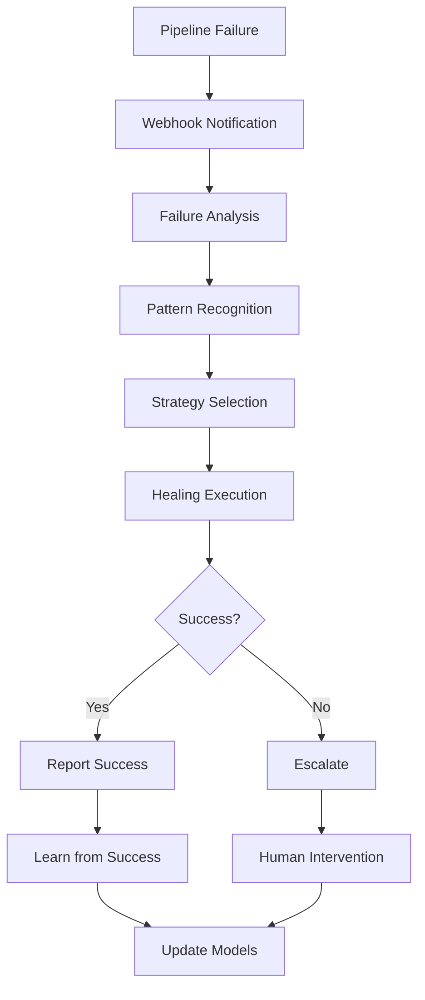

# Overview

Welcome to Self-Healing Pipeline Guard, an AI-powered CI/CD guardian that automatically detects, diagnoses, and fixes pipeline failures. This revolutionary tool reduces mean-time-to-green by up to 65% through intelligent remediation strategies.

## What is Self-Healing Pipeline Guard?

Self-Healing Pipeline Guard is an intelligent system that monitors your CI/CD pipelines across multiple platforms, automatically identifies failure patterns, and applies appropriate remediation strategies. It combines machine learning with proven engineering practices to minimize pipeline downtime and developer frustration.

### Key Benefits

- **🚀 Faster Recovery**: Automated healing reduces manual intervention time
- **💰 Cost Savings**: Fewer re-runs and less developer time spent on pipeline issues
- **📊 Improved Reliability**: Higher pipeline success rates through pattern learning
- **🔍 Deep Insights**: Comprehensive analytics on failure patterns and trends
- **⚡ Multi-Platform**: Works with GitHub Actions, GitLab CI, Jenkins, CircleCI, and more

## How It Works

### 1. Detection

The system receives webhook notifications from your CI/CD platform when a pipeline fails. It immediately begins analyzing the failure context, including logs, error messages, and metadata.

### 2. Analysis

Using a combination of pattern matching and machine learning models, the system classifies the failure type and determines the most likely cause. Common failure types include:

- Flaky tests
- Resource exhaustion (OOM, disk space)
- Network timeouts
- Dependency conflicts
- Infrastructure issues

### 3. Healing

Based on the failure analysis, the system selects and executes appropriate remediation strategies:

- **Retry with backoff**: For transient failures
- **Resource scaling**: For resource exhaustion issues  
- **Cache invalidation**: For dependency problems
- **Environment reset**: For state-related issues
- **Custom strategies**: User-defined healing actions

### 4. Learning

The system continuously learns from both successful and failed healing attempts, improving its accuracy and effectiveness over time.

## Supported Platforms

Self-Healing Pipeline Guard integrates with major CI/CD platforms:

| Platform | Support Level | Features |
|----------|---------------|----------|
| GitHub Actions | Full | Webhooks, API integration, workflow triggering |
| GitLab CI | Full | Pipeline hooks, API integration, job retry |
| Jenkins | Full | Build notifications, API integration, job management |
| CircleCI | Beta | Webhook integration, basic healing strategies |
| Azure DevOps | Planned | Coming in v1.2 |
| TeamCity | Planned | Coming in v1.3 |

## Architecture Overview

The system is built using modern, scalable technologies:

- **Backend**: Python with FastAPI for high-performance async processing
- **Database**: PostgreSQL for structured data, Redis for caching
- **ML Engine**: scikit-learn and TensorFlow for failure classification
- **Monitoring**: Prometheus and Grafana for comprehensive observability
- **Deployment**: Docker and Kubernetes for cloud-native scaling

## Security & Compliance

Security is built into every layer:

- **Authentication**: OAuth 2.0 and JWT-based authentication
- **Encryption**: TLS 1.3 for data in transit, AES-256 for data at rest
- **Access Control**: Role-based permissions with fine-grained controls
- **Audit Trail**: Complete logging of all healing actions
- **Compliance**: SOC 2, GDPR, and HIPAA compliance ready

## Getting Started

Ready to reduce your pipeline failures? Here's how to get started:

1. **[Quick Start](quickstart.md)**: Get up and running in 10 minutes
2. **[Installation](installation.md)**: Detailed installation instructions
3. **[Configuration](configuration.md)**: Configure for your environment
4. **[Platform Integration](../user-guide/platforms/)**: Connect your CI/CD platforms

## Use Cases

### Development Teams
- Reduce time spent debugging pipeline failures
- Improve developer productivity and satisfaction
- Maintain high deployment velocity

### DevOps Engineers  
- Minimize operational overhead
- Improve pipeline reliability metrics
- Reduce on-call incidents

### Engineering Managers
- Track and improve team efficiency
- Reduce costs associated with pipeline failures
- Gain insights into infrastructure reliability

## Success Stories

!!! success "Case Study: TechCorp"
    "After implementing Self-Healing Pipeline Guard, we saw a 60% reduction in pipeline failures and saved over 40 hours per week of developer time. Our deployment frequency increased by 45%."
    
    — Jane Smith, Senior DevOps Engineer

!!! success "Case Study: StartupXYZ"
    "The intelligent healing strategies helped us maintain a 95% pipeline success rate even as we scaled from 10 to 100 developers. The cost savings alone paid for the implementation in the first month."
    
    — John Doe, CTO

## Community & Support

- **Documentation**: Comprehensive guides and API reference
- **Community Forum**: Get help from other users and maintainers
- **GitHub Issues**: Report bugs and request features
- **Commercial Support**: Enterprise support available

## What's Next?

- Explore the [Quick Start Guide](quickstart.md) to set up your first healing strategy
- Read about [Platform Integration](../user-guide/platforms/) to connect your CI/CD tools
- Learn about [Healing Strategies](../user-guide/strategies/overview.md) to understand the available options
- Check out the [API Reference](../api/) for programmatic access

---

*Ready to transform your CI/CD reliability? Let's get started!*