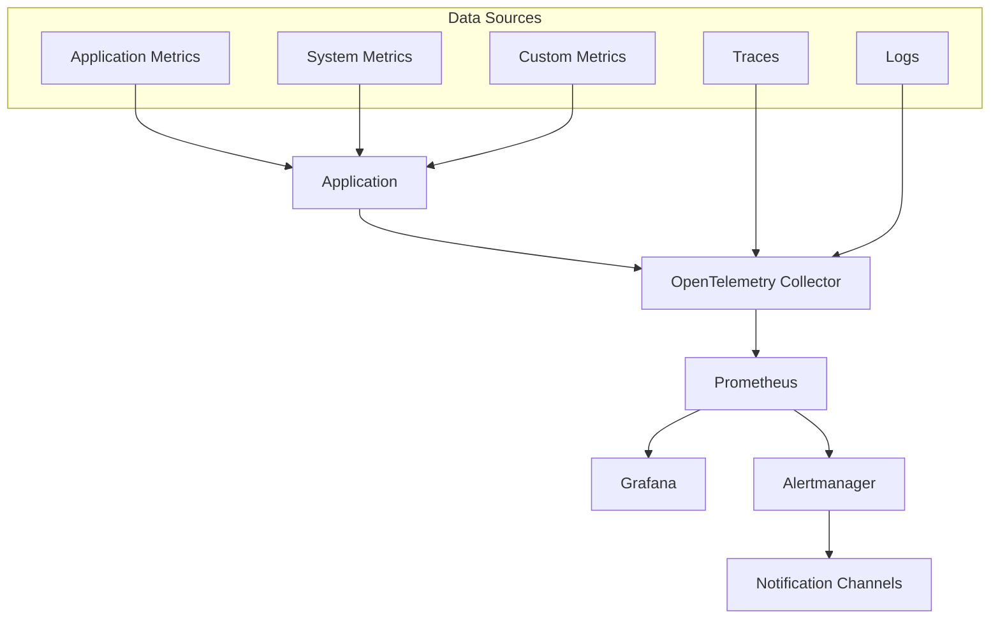

# Production Monitoring Setup Guide

## Overview

This guide provides comprehensive instructions for setting up production-grade monitoring for the Self-Healing Pipeline Guard using Prometheus, Grafana, and OpenTelemetry.

## Architecture



## Quick Start

### 1. Launch Monitoring Stack

```bash
# Start monitoring services
docker-compose -f docker-compose.yml -f docker-compose.monitoring.yml up -d

# Verify services
docker-compose ps
```

### 2. Access Dashboards

- **Grafana**: http://localhost:3000
  - Username: `admin`
  - Password: `admin` (change on first login)
- **Prometheus**: http://localhost:9090
- **Alertmanager**: http://localhost:9093

## Configuration Details

### Prometheus Configuration

Key metrics collected:

```yaml
# Application metrics
- job_name: 'healing-guard'
  static_configs:
    - targets: ['app:8000']
  metrics_path: '/metrics'
  scrape_interval: 15s

# System metrics  
- job_name: 'node-exporter'
  static_configs:
    - targets: ['node-exporter:9100']

# Database metrics
- job_name: 'postgres-exporter'
  static_configs:
    - targets: ['postgres-exporter:9187']
```

### Key Performance Indicators (KPIs)

#### Application Performance
- **Response Time**: 95th percentile < 200ms
- **Throughput**: > 1000 requests/minute
- **Error Rate**: < 0.1%
- **Availability**: > 99.9%

#### Resource Utilization
- **CPU Usage**: < 70% average
- **Memory Usage**: < 80% of allocated
- **Disk I/O**: < 80% capacity
- **Network**: Latency < 50ms

#### Business Metrics
- **Pipeline Healing Success Rate**: > 95%
- **Detection Accuracy**: > 90%
- **Time to Recovery**: < 5 minutes
- **False Positive Rate**: < 5%

### Alert Rules

```yaml
groups:
  - name: healing-guard.rules
    rules:
      # High error rate
      - alert: HighErrorRate
        expr: rate(http_requests_total{status=~"5.."}[5m]) > 0.01
        for: 5m
        labels:
          severity: critical
        annotations:
          summary: "High error rate detected"
          
      # High response time
      - alert: HighResponseTime
        expr: histogram_quantile(0.95, rate(http_request_duration_seconds_bucket[5m])) > 0.2
        for: 10m
        labels:
          severity: warning
        annotations:
          summary: "High response time detected"
          
      # Service down
      - alert: ServiceDown
        expr: up{job="healing-guard"} == 0
        for: 1m
        labels:
          severity: critical
        annotations:
          summary: "Service is down"
```

## Dashboard Configuration

### Pre-configured Dashboards

1. **Healing Guard Overview** (`/config/grafana/dashboards/healing-guard-overview.json`)
   - Application performance metrics
   - Business KPIs
   - System health status

2. **System Resources**
   - CPU, Memory, Disk usage
   - Network statistics
   - Database performance

3. **ML Model Performance**
   - Model accuracy metrics
   - Inference latency
   - Training metrics

### Custom Metrics

Add custom metrics to your application:

```python
from prometheus_client import Counter, Histogram, Gauge

# Business metrics
pipeline_failures_detected = Counter(
    'pipeline_failures_detected_total',
    'Total number of pipeline failures detected'
)

healing_attempts = Counter(
    'healing_attempts_total',
    'Total number of healing attempts',
    ['status', 'pipeline_type']
)

healing_duration = Histogram(
    'healing_duration_seconds',
    'Time taken to heal pipeline failures'
)

active_pipelines = Gauge(
    'active_pipelines',
    'Number of active pipelines being monitored'
)
```

## Production Deployment

### Kubernetes Deployment

```yaml
# monitoring-namespace.yaml
apiVersion: v1
kind: Namespace
metadata:
  name: monitoring

---
# prometheus-deployment.yaml
apiVersion: apps/v1
kind: Deployment
metadata:
  name: prometheus
  namespace: monitoring
spec:
  replicas: 1
  selector:
    matchLabels:
      app: prometheus
  template:
    metadata:
      labels:
        app: prometheus
    spec:
      containers:
      - name: prometheus
        image: prom/prometheus:latest
        ports:
        - containerPort: 9090
        volumeMounts:
        - name: config
          mountPath: /etc/prometheus
        - name: data
          mountPath: /prometheus
      volumes:
      - name: config
        configMap:
          name: prometheus-config
      - name: data
        persistentVolumeClaim:
          claimName: prometheus-data
```

### Security Configuration

```yaml
# Enable TLS and authentication
global:
  external_url: https://prometheus.company.com
  
rule_files:
  - "/etc/prometheus/rules/*.yml"

scrape_configs:
  - job_name: 'healing-guard'
    scheme: https
    tls_config:
      ca_file: /etc/ssl/certs/ca.crt
      cert_file: /etc/ssl/certs/client.crt
      key_file: /etc/ssl/private/client.key
    basic_auth:
      username: monitoring
      password_file: /etc/prometheus/secrets/password
```

## Alerting Setup

### Slack Integration

```yaml
# alertmanager.yml
route:
  group_by: ['alertname']
  group_wait: 10s
  group_interval: 10s
  repeat_interval: 1h
  receiver: 'web.hook'

receivers:
- name: 'web.hook'
  slack_configs:
  - api_url: 'YOUR_SLACK_WEBHOOK_URL'
    channel: '#alerts'
    title: 'Healing Guard Alert'
    text: '{{ range .Alerts }}{{ .Annotations.summary }}{{ end }}'
```

### PagerDuty Integration

```yaml
receivers:
- name: 'pagerduty'
  pagerduty_configs:
  - service_key: 'YOUR_PAGERDUTY_KEY'
    description: '{{ .GroupLabels.alertname }} - {{ .Annotations.summary }}'
```

## Troubleshooting

### Common Issues

1. **Metrics not appearing**
   - Check service discovery configuration
   - Verify network connectivity
   - Review application metrics endpoint

2. **High cardinality metrics**
   - Limit label values
   - Use recording rules for aggregation
   - Implement metric retention policies

3. **Alert fatigue**
   - Tune alert thresholds
   - Implement alert grouping
   - Set up proper escalation policies

### Debugging Commands

```bash
# Check Prometheus targets
curl http://localhost:9090/api/v1/targets

# Validate configuration
promtool check config /etc/prometheus/prometheus.yml

# Query metrics directly
curl "http://localhost:9090/api/v1/query?query=up"

# Check Grafana health
curl http://localhost:3000/api/health
```

## Performance Optimization

### Storage Optimization

```yaml
# prometheus.yml
global:
  scrape_interval: 15s
  evaluation_interval: 15s

# Retention policy
command:
  - '--storage.tsdb.retention.time=90d'
  - '--storage.tsdb.retention.size=50GB'
  - '--storage.tsdb.wal-compression'
```

### Query Optimization

```promql
# Use recording rules for expensive queries
groups:
  - name: healing_guard_aggregations
    interval: 30s
    rules:
      - record: healing_guard:request_rate_5m
        expr: rate(http_requests_total[5m])
      
      - record: healing_guard:error_rate_5m
        expr: rate(http_requests_total{status=~"5.."}[5m])
```

## Compliance and Auditing

### Data Retention Policies

- **Metrics**: 90 days detailed, 1 year aggregated
- **Logs**: 30 days full detail, 90 days aggregated
- **Traces**: 7 days detailed sampling

### Access Control

```yaml
# grafana.ini
[auth]
disable_login_form = false
disable_signout_menu = false

[auth.ldap]
enabled = true
config_file = /etc/grafana/ldap.toml
allow_sign_up = false

[users]
allow_sign_up = false
auto_assign_org = true
auto_assign_org_role = Viewer
```

## Maintenance Procedures

### Regular Tasks

1. **Weekly**
   - Review dashboard performance
   - Check alert accuracy
   - Update retention policies

2. **Monthly**
   - Analyze capacity trends
   - Review alert thresholds
   - Update documentation

3. **Quarterly**
   - Performance benchmark review
   - Security audit
   - Disaster recovery testing

### Backup Procedures

```bash
#!/bin/bash
# backup-monitoring.sh

# Backup Prometheus data
kubectl exec -n monitoring prometheus-0 -- tar czf - /prometheus | \
  aws s3 cp - s3://backups/prometheus/$(date +%Y%m%d).tar.gz

# Backup Grafana dashboards
kubectl get configmaps -n monitoring -o yaml | \
  aws s3 cp - s3://backups/grafana/dashboards-$(date +%Y%m%d).yaml
```

## Cost Optimization

### Resource Planning

| Component | CPU | Memory | Storage | Cost/Month |
|-----------|-----|--------|---------|------------|
| Prometheus | 2 cores | 8GB | 100GB SSD | $150 |
| Grafana | 1 core | 2GB | 10GB SSD | $50 |
| Alertmanager | 0.5 cores | 1GB | 5GB SSD | $25 |
| **Total** | **3.5 cores** | **11GB** | **115GB** | **$225** |

### Optimization Strategies

1. **Use recording rules** for expensive queries
2. **Implement metric relabeling** to reduce cardinality
3. **Configure appropriate retention policies**
4. **Use remote storage** for long-term data
5. **Implement auto-scaling** for variable workloads

## Support and Documentation

- **Prometheus Documentation**: https://prometheus.io/docs/
- **Grafana Documentation**: https://grafana.com/docs/
- **OpenTelemetry Documentation**: https://opentelemetry.io/docs/
- **Internal Runbooks**: `/docs/operations/runbooks/`

---

**Note**: This monitoring setup is designed for production environments. Adjust configurations based on your specific requirements and constraints.