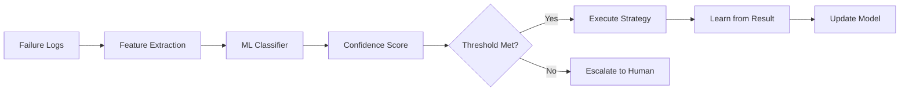
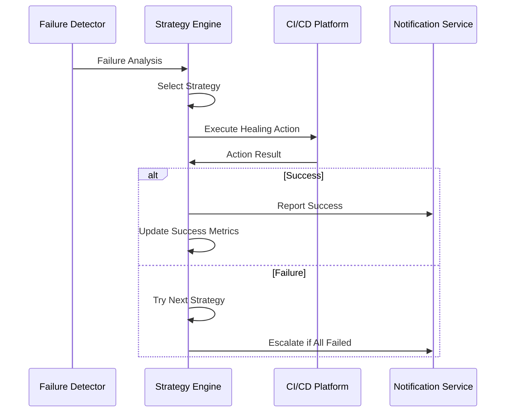

# Healing Strategies Overview

Healing strategies are the core of Self-Healing Pipeline Guard's intelligence. They define how the system identifies, analyzes, and remediates different types of pipeline failures. Each strategy combines pattern recognition with automated remediation actions to restore pipeline health.

## Strategy Types

### 1. Pattern-Based Strategies

These strategies use predefined patterns to identify and fix common failure types:

| Strategy | Description | Success Rate | Use Cases |
|----------|-------------|--------------|-----------|
| **Flaky Test Retry** | Retries tests that fail intermittently | 85-95% | Network timeouts, race conditions |
| **Resource Scaling** | Increases resources for OOM/disk issues | 90-98% | Memory exhaustion, disk space |
| **Cache Invalidation** | Clears caches for dependency issues | 80-90% | Stale dependencies, build artifacts |
| **Network Retry** | Retries network-related failures | 85-92% | External service timeouts |
| **Environment Reset** | Resets environment state | 70-85% | State corruption, permission issues |

### 2. ML-Enhanced Strategies

These strategies use machine learning to improve detection accuracy and success rates:



- **Intelligent Classification**: Uses trained models to classify failure types
- **Confidence Scoring**: Only acts when confidence exceeds threshold
- **Continuous Learning**: Improves accuracy based on outcomes
- **Context Awareness**: Considers repository, team, and historical patterns

### 3. Custom Strategies

Organizations can define custom strategies for specific needs:

```yaml
# Example custom strategy
custom_database_connection_retry:
  name: "Database Connection Retry"
  description: "Retry database connection failures with exponential backoff"
  
  detection:
    patterns:
      - "connection refused"
      - "database unavailable"
      - "timeout connecting to database"
    
  conditions:
    - confidence > 0.8
    - failure_count < 3
    - time_since_last_attempt > 60
  
  actions:
    - wait: "exponential_backoff"
    - retry: "pipeline_stage"
    - notify: "database_team"
  
  learning:
    track_success_rate: true
    update_confidence: true
```

## Strategy Configuration

### Basic Configuration

```yaml
# healing-strategies.yml
strategies:
  flaky_test_retry:
    enabled: true
    confidence_threshold: 0.75
    max_retries: 3
    backoff_strategy: "exponential"
    timeout: 300
    
  resource_scaling:
    enabled: true
    memory_increment: "1GB"
    cpu_increment: "0.5"
    max_scaling_factor: 4
    
  cache_invalidation:
    enabled: true
    cache_types: ["npm", "pip", "docker", "gradle"]
    selective_clearing: true
```

### Advanced Configuration

```yaml
strategies:
  intelligent_flaky_detection:
    enabled: true
    ml_model: "gradient_boost_v2"
    
    features:
      - test_name
      - failure_message
      - execution_time
      - historical_success_rate
      - time_of_day
      - commit_author
      - file_changes
    
    thresholds:
      confidence: 0.8
      historical_failures: 3
      time_window: "24h"
    
    actions:
      primary: "retry_with_isolation"
      fallback: "skip_and_notify"
      escalation: "create_issue"
    
    learning:
      feedback_weight: 0.1
      model_update_frequency: "daily"
      feature_importance_tracking: true
```

## Strategy Execution Flow

### 1. Failure Detection

When a pipeline fails, the system:

1. **Receives webhook notification** from CI/CD platform
2. **Extracts failure context** (logs, metadata, environment)
3. **Normalizes data** across different platforms
4. **Queues for analysis** with priority based on repository importance

### 2. Pattern Analysis

```python
# Simplified analysis flow
def analyze_failure(failure_context):
    # Extract features from logs and metadata
    features = extract_features(failure_context.logs)
    
    # Run through pattern matchers
    patterns = match_patterns(features)
    
    # Apply ML classification if available
    ml_classification = classify_with_ml(features)
    
    # Combine results with confidence scoring
    return combine_classifications(patterns, ml_classification)
```

### 3. Strategy Selection

The system selects strategies based on:

- **Failure classification confidence**
- **Historical success rates** for similar failures
- **Repository-specific preferences**
- **Cost considerations**
- **Risk assessment**

### 4. Execution



## Strategy Effectiveness Metrics

### Success Rate Tracking

```python
# Strategy effectiveness metrics
class StrategyMetrics:
    def __init__(self, strategy_name):
        self.name = strategy_name
        self.total_attempts = 0
        self.successful_heals = 0
        self.false_positives = 0
        self.average_healing_time = 0
        self.cost_per_healing = 0
    
    @property
    def success_rate(self):
        return self.successful_heals / self.total_attempts
    
    @property
    def precision(self):
        return self.successful_heals / (self.successful_heals + self.false_positives)
```

### Performance Monitoring

Monitor these key metrics for each strategy:

- **Success Rate**: Percentage of successful healing attempts
- **Precision**: Ratio of true positives to total positive predictions
- **Recall**: Percentage of actual failures correctly identified
- **Healing Time**: Average time from failure detection to resolution
- **Cost Efficiency**: Cost per successful healing
- **User Satisfaction**: Developer feedback on healing quality

## Best Practices

### 1. Strategy Tuning

```yaml
# Start conservative, tune based on results
initial_configuration:
  confidence_threshold: 0.9  # High confidence to avoid false positives
  max_retries: 2             # Limit resource usage
  timeout: 180               # Reasonable timeout

# Gradually optimize based on metrics
optimized_configuration:
  confidence_threshold: 0.75  # Lower after proving effectiveness
  max_retries: 3              # Increase for better coverage
  timeout: 300                # Allow more time for complex healing
```

### 2. Repository-Specific Configuration

```yaml
# Different strategies for different types of repositories
frontend_repository:
  strategies:
    - flaky_test_retry      # Common for UI tests
    - cache_invalidation    # Node modules issues
    - browser_retry         # Browser-specific failures

backend_repository:
  strategies:
    - database_retry        # Database connection issues
    - resource_scaling      # Memory/CPU intensive operations
    - service_dependency    # External service failures

ml_repository:
  strategies:
    - data_retry           # Data pipeline failures
    - model_rollback       # Model deployment issues
    - gpu_resource_scaling # GPU memory issues
```

### 3. Safety Mechanisms

```yaml
safety_controls:
  max_concurrent_healings: 5
  cost_limit_per_hour: 100
  escalation_after_failures: 3
  human_approval_required:
    - production_deployments
    - security_related_changes
    - high_cost_operations
```

## Integration with Development Workflow

### 1. Developer Notifications

```yaml
notifications:
  healing_started:
    channels: ["slack", "email"]
    recipients: ["commit_author", "team_lead"]
    message: "Healing attempt started for your commit"
  
  healing_successful:
    channels: ["slack"]
    message: "Pipeline healed automatically - no action needed"
  
  healing_failed:
    channels: ["slack", "email", "jira"]
    priority: "high"
    message: "Manual intervention required"
```

### 2. Learning from Developer Feedback

```python
# Collect feedback to improve strategies
def collect_healing_feedback(healing_id, developer_feedback):
    feedback = {
        'healing_id': healing_id,
        'developer_satisfaction': developer_feedback.rating,
        'was_helpful': developer_feedback.was_helpful,
        'suggestions': developer_feedback.suggestions,
        'would_change': developer_feedback.would_change
    }
    
    # Use feedback to adjust strategy parameters
    update_strategy_weights(feedback)
```

## Troubleshooting Strategies

### Common Issues

1. **Low Success Rates**
   - Check confidence thresholds
   - Review pattern matching accuracy
   - Validate ML model performance
   - Analyze failure classification

2. **High False Positive Rates**
   - Increase confidence thresholds
   - Improve pattern specificity
   - Add negative pattern examples
   - Implement better feature engineering

3. **Slow Healing Times**
   - Optimize strategy execution order
   - Parallel execution where possible
   - Reduce unnecessary steps
   - Improve resource allocation

### Debugging Tools

```bash
# Check strategy performance
curl http://localhost:8000/api/v1/strategies/metrics

# Analyze recent failures
curl http://localhost:8000/api/v1/failures/analysis

# Test strategy against historical data
curl -X POST http://localhost:8000/api/v1/strategies/test \
  -d '{"strategy": "flaky_test_retry", "failure_id": "12345"}'
```

## Next Steps

- **[Flaky Test Strategies](flaky-tests.md)**: Deep dive into handling flaky tests
- **[Resource Issue Strategies](resource-issues.md)**: Managing memory and CPU problems
- **[Dependency Strategies](dependencies.md)**: Resolving dependency conflicts
- **[Custom Strategies](custom.md)**: Creating your own healing strategies

---

*Effective healing strategies are the key to reducing pipeline failures. Start with proven patterns and gradually customize for your specific needs.*